# 🎨 MERMAID & AI PROMPTS FOR ALL 19 FIGURES

**Complete copy-paste ready prompts for generating diagrams instantly!**

---

## 📍 CHAPTER 1: INTRODUCTION

### **Figure 1.1: E-Commerce Market Overview**

**Platform:** Google Sheets / Excel → Export as Image

**Prompt for ChatGPT/Claude:**
```
Create a bar chart showing e-commerce market growth from 2020-2026 with:
- Years on X-axis: 2020, 2021, 2022, 2023, 2024, 2025, 2026
- Market size (billions) on Y-axis: 0-5000
- Data for overall e-commerce and hygiene products segment separately
- Show 15% CAGR growth
- Use professional colors (blue for total, green for hygiene segment)
- Add title "E-commerce Market Size & Growth Trends"
- Include legend

Use this data:
2020: Overall 4000B, Hygiene 200B
2021: Overall 4600B, Hygiene 250B
2022: Overall 5200B, Hygiene 320B
2023: Overall 5800B, Hygiene 420B
2024: Overall 6500B, Hygiene 550B
2025: Overall 7200B, Hygiene 720B
2026: Overall 7900B, Hygiene 940B
```

**Quick Alternative:** Use Google Sheets, create bar chart, download as PNG

---

### **Figure 1.2: System Architecture Overview**

**Platform:** Mermaid

**Copy-Paste Mermaid Code:**
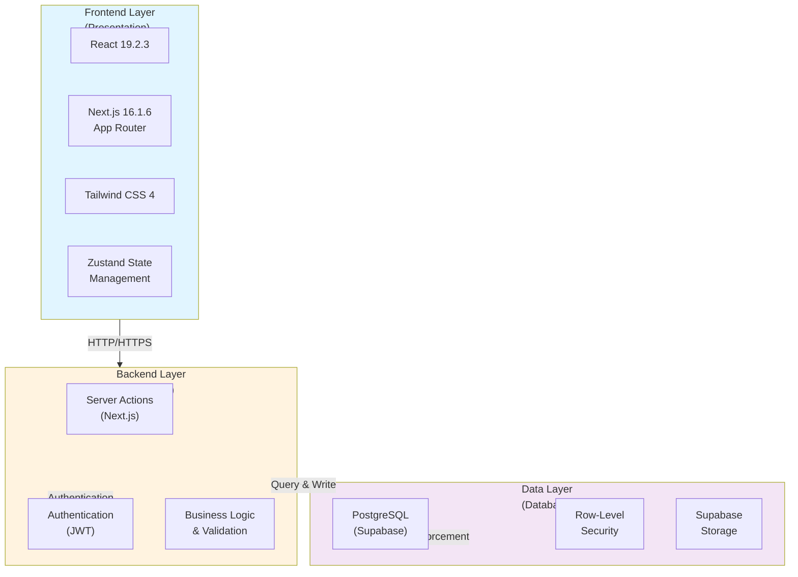

**AI Prompt for Claude/ChatGPT:**
```
Create a professional system architecture diagram showing:
- Three layers: Frontend (React, Next.js), Backend (Server Actions, Auth), Database (PostgreSQL)
- Show data flow between layers with arrows
- Label each technology clearly
- Use light blue for frontend, light orange for backend, light purple for database
- Make it suitable for an academic project report
- High professional quality
```

---

## 📍 CHAPTER 2: REQUIREMENTS ANALYSIS

### **Figure 2.1: Use Case Diagram - Customer**

**Platform:** Mermaid

**Copy-Paste Mermaid Code:**
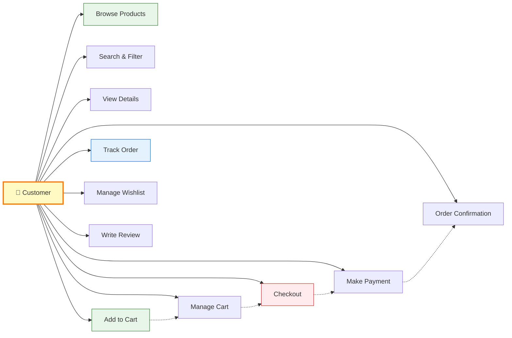

**AI Prompt for Lucidchart/Draw.io:**
```
Create a UML use case diagram with:
- Actor: Customer (stick figure on left)
- Use cases: 
  1. Browse Products
  2. Search & Filter Products
  3. View Product Details
  4. Add to Cart
  5. Manage Cart (update qty, remove items)
  6. Checkout Process
  7. Make Payment
  8. View Order Confirmation
  9. Track Order Status
  10. Manage Wishlist
  11. Write Product Review

- Show relationships between use cases
- Use professional colors
- Make it clear and easy to understand
```

---

### **Figure 2.2: Use Case Diagram - Admin**

**Platform:** Mermaid

**Copy-Paste Mermaid Code:**
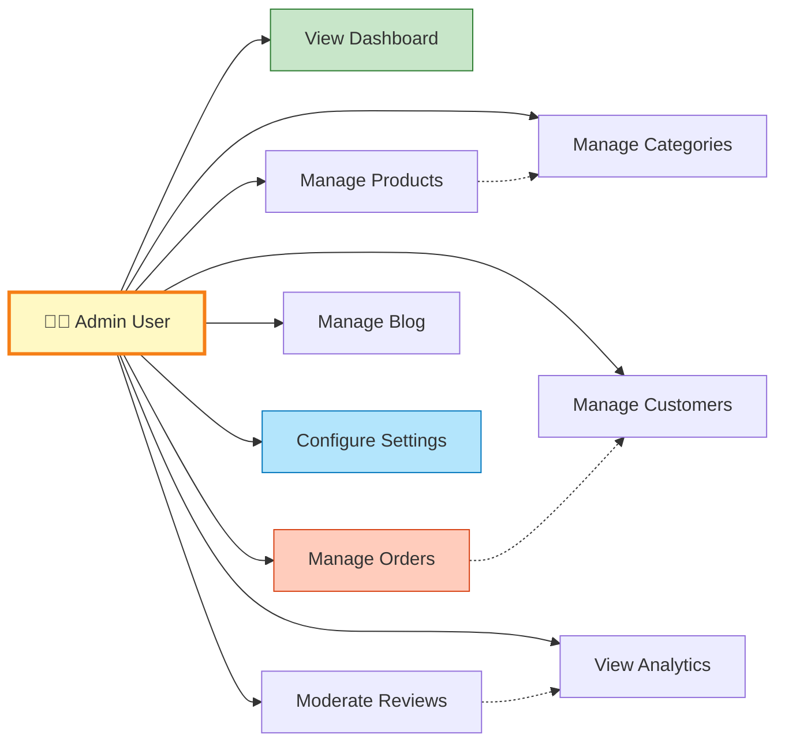

**AI Prompt for Lucidchart/Draw.io:**
```
Create a UML use case diagram with:
- Actor: Admin (stick figure on left)
- Use cases:
  1. View Dashboard (statistics & metrics)
  2. Manage Products (CRUD operations)
  3. Manage Categories (hierarchical)
  4. Manage Orders (status, tracking)
  5. Manage Customers (view profiles, history)
  6. Moderate Reviews (approve/reject)
  7. Manage Blog (publish posts)
  8. Configure Settings (store settings)
  9. View Analytics (business metrics)

- Show inclusion/extension relationships
- Color-code by function type
- Professional UML format
```

---

## 📍 CHAPTER 3: SYSTEM DESIGN

### **Figure 3.1: Database Schema Diagram** ⭐ HIGH PRIORITY

**Platform:** Mermaid (Entity Relationship Diagram)

**Copy-Paste Mermaid Code:**
```mermaid
erDiagram
    USERS ||--o{ ADDRESSES : have
    USERS ||--o{ ORDERS : place
    USERS ||--o{ CART_ITEMS : have
    USERS ||--o{ REVIEWS : write
    USERS ||--o{ WISHLIST_ITEMS : have
    USERS ||--o{ BLOG_POSTS : author
    
    PRODUCTS ||--o{ PRODUCT_IMAGES : "has images"
    PRODUCTS ||--o{ PRODUCT_VARIANTS : "has variants"
    PRODUCTS ||--o{ ORDER_ITEMS : "ordered in"
    PRODUCTS ||--o{ CART_ITEMS : "added to"
    PRODUCTS ||--o{ REVIEWS : "reviewed in"
    PRODUCTS ||--o{ WISHLIST_ITEMS : "wish for"
    PRODUCTS }o--|| CATEGORIES : "belongs to"
    
    ORDERS ||--o{ ORDER_ITEMS : "contains"
    ORDERS ||--o{ PAYMENTS : "has"
    ORDERS ||--o{ SHIPMENTS : "has"
    ORDERS }o--|| ADDRESSES : "ships to"
    
    CATEGORIES ||--o{ CATEGORIES : "parent category"
    
    USERS : PK id UUID
    USERS : email string
    USERS : first_name string
    USERS : last_name string
    USERS : phone string
    
    PRODUCTS : PK id UUID
    PRODUCTS : name string
    PRODUCTS : slug string
    PRODUCTS : base_price decimal
    PRODUCTS : stock_quantity int
    PRODUCTS : sku string
    PRODUCTS : category_id UUID FK
    
    ORDERS : PK id UUID
    ORDERS : user_id UUID FK
    ORDERS : order_number string
    ORDERS : status enum
    ORDERS : total decimal
    ORDERS : created_at timestamp
    
    ORDER_ITEMS : PK id UUID
    ORDER_ITEMS : order_id UUID FK
    ORDER_ITEMS : product_id UUID FK
    ORDER_ITEMS : variant_id UUID FK
    ORDER_ITEMS : quantity int
    
    ADDRESSES : PK id UUID
    ADDRESSES : user_id UUID FK
    ADDRESSES : full_name string
    ADDRESSES : city string
    ADDRESSES : postal_code string
    
    CART_ITEMS : PK id UUID
    CART_ITEMS : user_id UUID FK
    CART_ITEMS : product_id UUID FK
    CART_ITEMS : quantity int
    
    REVIEWS : PK id UUID
    REVIEWS : product_id UUID FK
    REVIEWS : user_id UUID FK
    REVIEWS : rating int
    REVIEWS : status enum
    
    WISHLIST_ITEMS : PK id UUID
    WISHLIST_ITEMS : user_id UUID FK
    WISHLIST_ITEMS : product_id UUID FK
    
    PRODUCT_VARIANTS : PK id UUID
    PRODUCT_VARIANTS : product_id UUID FK
    PRODUCT_VARIANTS : name string
    PRODUCT_VARIANTS : price decimal
    PRODUCT_VARIANTS : stock_quantity int
    
    PRODUCT_IMAGES : PK id UUID
    PRODUCT_IMAGES : product_id UUID FK
    PRODUCT_IMAGES : image_url string
    PRODUCT_IMAGES : is_primary boolean
    
    CATEGORIES : PK id UUID
    CATEGORIES : name string
    CATEGORIES : parent_id UUID FK
    
    BLOG_POSTS : PK id UUID
    BLOG_POSTS : author_id UUID FK
    BLOG_POSTS : title string
    BLOG_POSTS : slug string
    BLOG_POSTS : status enum
    
    PAYMENTS : PK id UUID
    PAYMENTS : order_id UUID FK
    PAYMENTS : payment_id string
    PAYMENTS : status enum
    
    SHIPMENTS : PK id UUID
    SHIPMENTS : order_id UUID FK
    SHIPMENTS : tracking_number string
    SHIPMENTS : status enum
```

**AI Prompt for dbdiagram.io (Better Option):**
```
Create a database schema for an e-commerce platform with these tables:

Table: users (id, email, first_name, last_name, phone, created_at)
Table: products (id, name, slug, base_price, stock_quantity, sku, category_id, created_at)
Table: categories (id, name, slug, parent_id, is_active)
Table: product_variants (id, product_id, name, price, stock_quantity)
Table: product_images (id, product_id, image_url, is_primary)
Table: orders (id, user_id, order_number, status, total, created_at)
Table: order_items (id, order_id, product_id, variant_id, quantity, unit_price)
Table: addresses (id, user_id, address_type, full_name, city, state, postal_code)
Table: cart_items (id, user_id, product_id, quantity)
Table: reviews (id, product_id, user_id, rating, status, verified_purchase)
Table: wishlist_items (id, user_id, product_id)
Table: blog_posts (id, author_id, title, slug, status, published_at)
Table: payments (id, order_id, payment_id, status)
Table: shipments (id, order_id, tracking_number, status)

Add all relationships and make it professional-looking.
```

---

### **Figure 3.2: System Architecture Layers**

**Platform:** Mermaid

**Copy-Paste Mermaid Code:**
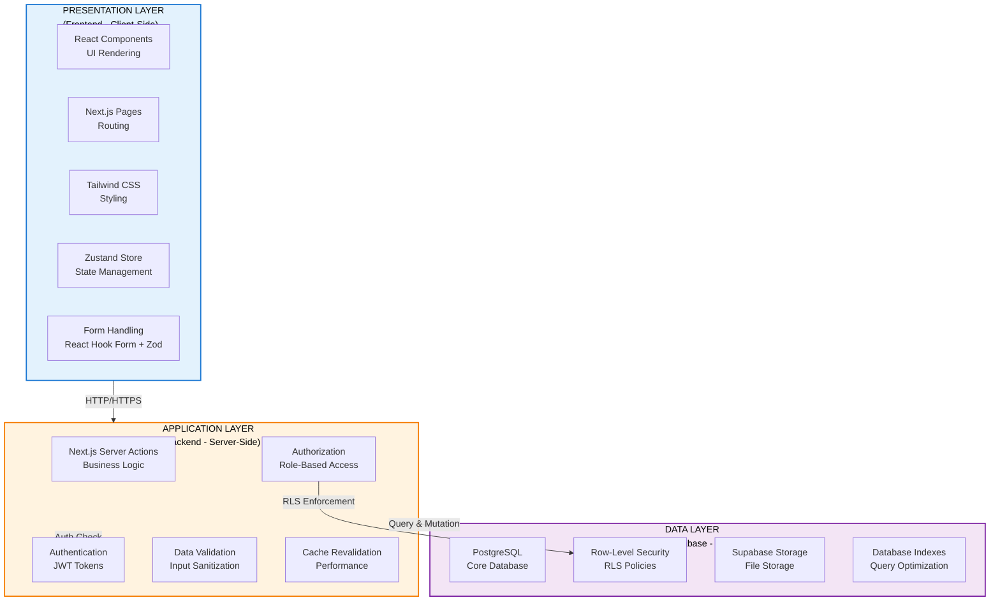

**AI Prompt:**
```
Create a professional three-layer system architecture diagram showing:

PRESENTATION LAYER:
- React Components (UI Rendering)
- Next.js Pages (Routing)
- Tailwind CSS (Styling)
- Zustand Store (Client State)
- Form Handling

APPLICATION LAYER:
- Server Actions (Business Logic)
- Authentication (JWT)
- Authorization (RBAC)
- Data Validation
- Cache Revalidation

DATA LAYER:
- PostgreSQL (Database)
- Row-Level Security (RLS)
- Storage Services
- Query Optimization

Show data flow between layers with arrows.
Color: Light blue for presentation, light orange for application, light purple for data.
```

---

### **Figure 3.3: Authentication Flow Diagram**

**Platform:** Mermaid (Flowchart)

**Copy-Paste Mermaid Code:**
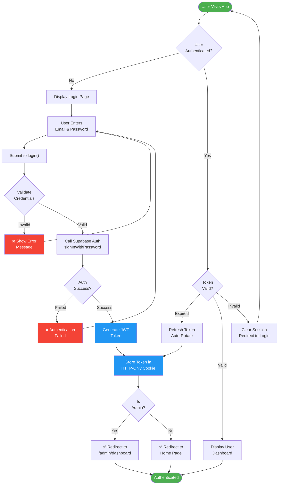

**AI Prompt:**
```
Create a detailed authentication flow diagram showing:
1. User visits app
2. Check if authenticated
3. If no: Show login page → Enter credentials → Validate
4. If invalid: Show error and retry
5. If valid: Call Supabase Auth
6. Generate JWT token
7. Store in HTTP-only cookie
8. Check if admin role
9. Redirect to appropriate dashboard
10. Handle token expiration and refresh

Use colors:
- Green for start/end
- Red for errors
- Blue for success actions

Show all decision points and alternative paths.
```

---

### **Figure 3.4: Order Processing Workflow**

**Platform:** Mermaid (Flowchart)

**Copy-Paste Mermaid Code:**
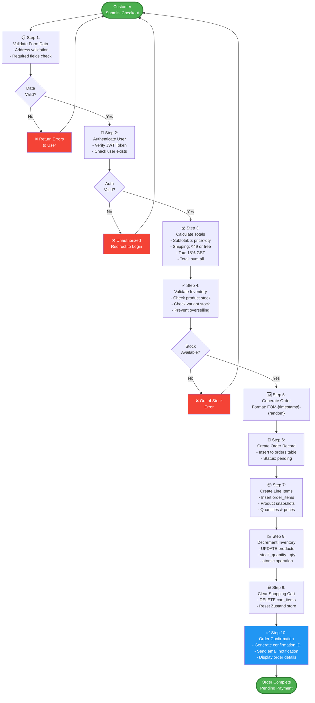

**AI Prompt:**
```
Create a comprehensive order processing workflow diagram showing these 10 steps:

1. Validate checkout form (address, required fields)
2. Authenticate user (verify JWT)
3. Calculate totals (subtotal, shipping based on threshold, 18% tax)
4. Validate inventory (check stock for products and variants)
5. Generate order number (format: FOM-{timestamp}-{random})
6. Create order record (insert to database)
7. Create order line items (insert order_items with product snapshots)
8. Decrement inventory (update product stock quantities)
9. Clear shopping cart (delete from cart_items)
10. Send confirmation (generate ID, email notification)

Show error paths for invalid data, auth failure, and out of stock.
Use professional colors and clear decision diamonds.
```

---

### **Figure 3.5: Product Catalog Structure**

**Platform:** Mermaid (Graph/Mindmap)

**Copy-Paste Mermaid Code:**
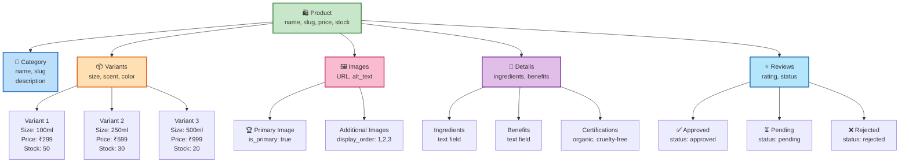

**AI Prompt:**
```
Create a product catalog structure diagram showing:

Central: Product (with name, slug, price, stock)

Connected to:
1. Category (hierarchical - name, slug, description)
2. Variants (separate pricing and stock - size, scent, color)
   - Show 3 example variants with different prices
3. Images (multiple images, one marked as primary)
   - Primary image
   - Additional images with display order
4. Details (ingredients, benefits, certifications)
   - Ingredients text
   - Benefits text
   - Certifications array
5. Reviews (with status - approved, pending, rejected)
   - Show rating, status, verified purchase flag

Use different colors for each section.
Professional hierarchical layout.
```

---

### **Figure 3.6: Component Hierarchy Tree**

**Platform:** Mermaid (Graph)

**Copy-Paste Mermaid Code:**
```mermaid
graph TD
    App["🚀 App<br/>Root Component"]
    
    App --> RootLayout["📄 RootLayout<br/>Providers, Global Styles"]
    
    RootLayout --> Marketing["🏪 MarketingLayout<br/>Public Pages"]
    RootLayout --> Account["👤 AccountLayout<br/>User Pages"]
    RootLayout --> Auth["🔐 AuthLayout<br/>Auth Pages"]
    RootLayout --> Admin["⚙️ AdminLayout<br/>Admin Pages"]
    
    Marketing --> HomePage["Home Page<br/>Products, CTAs"]
    Marketing --> ProductList["Product Listing<br/>Browse, Search, Filter"]
    Marketing --> ProductDetail["Product Detail<br/>Images, Reviews, Variants"]
    Marketing --> Cart["Shopping Cart<br/>Items, Totals"]
    Marketing --> Checkout["Checkout<br/>Address, Payment"]
    Marketing --> Blog["Blog Pages<br/>Posts, Listing"]
    
    Account --> Dashboard["Account Dashboard<br/>Overview"]
    Account --> Orders["Order History<br/>Status, Details"]
    Account --> Addresses["Address Management<br/>Add, Edit, Delete"]
    Account --> Wishlist["Wishlist<br/>Saved Items"]
    Account --> Settings["Account Settings<br/>Profile, Password"]
    
    Auth --> Login["Login Page<br/>Email, Password"]
    Auth --> Signup["Signup Page<br/>Registration Form"]
    Auth --> ForgotPass["Forgot Password<br/>Recovery Email"]
    
    Admin --> AdminDash["Admin Dashboard<br/>Statistics, Metrics"]
    Admin --> Products["Product Management<br/>CRUD, Variants, Images"]
    Admin --> Categories["Category Management<br/>Create, Edit, Delete"]
    Admin --> Orders2["Order Management<br/>Status, Tracking"]
    Admin --> Customers["Customer Management<br/>Profiles, History"]
    Admin --> Reviews["Review Moderation<br/>Approve, Reject"]
    Admin --> BlogMgmt["Blog Management<br/>Posts, Drafts"]
    Admin --> Settings2["Store Settings<br/>Configuration"]
    
    style App fill:#64b5f6,stroke:#1976d2,stroke-width:3px,color:#fff
    style RootLayout fill:#81c784,stroke:#388e3c,stroke-width:2px,color:#fff
    style Marketing fill:#ffb74d,stroke:#f57c00,stroke-width:2px,color:#fff
    style Account fill:#ba68c8,stroke:#7b1fa2,stroke-width:2px,color:#fff
    style Auth fill:#e57373,stroke:#d32f2f,stroke-width:2px,color:#fff
    style Admin fill:#4dd0e1,stroke:#00838f,stroke-width:2px,color:#fff
```

**AI Prompt:**
```
Create a React component hierarchy tree showing:

Root: App component

Level 1 Layouts:
- RootLayout (global)
- MarketingLayout (public)
- AccountLayout (user)
- AuthLayout (authentication)
- AdminLayout (admin)

MarketingLayout children:
- Home Page
- Product Listing
- Product Detail
- Shopping Cart
- Checkout
- Blog Pages

AccountLayout children:
- Dashboard
- Order History
- Addresses
- Wishlist
- Settings

AuthLayout children:
- Login
- Signup
- Forgot Password

AdminLayout children:
- Dashboard
- Products
- Categories
- Orders
- Customers
- Reviews
- Blog Management
- Settings

Use colors to distinguish layouts.
Professional tree structure.
Show clear parent-child relationships.
```

---

## 📍 CHAPTER 4: IMPLEMENTATION & TESTING

### **Figure 4.1: Application Directory Structure**

**Platform:** Mermaid (Graph)

**Copy-Paste Mermaid Code:**
```mermaid
graph TD
    Root["📦 HTM-ECOMM<br/>Root Directory"]
    
    App["📁 app/<br/>Next.js App Router"]
    Components["📁 components/<br/>Reusable Components"]
    Stores["📁 stores/<br/>Zustand Stores"]
    Lib["📁 lib/<br/>Utilities & Helpers"]
    Types["📁 types/<br/>TypeScript Types"]
    Actions["📁 actions/<br/>Server Actions"]
    Public["📁 public/<br/>Static Files"]
    Config["⚙️ Config Files"]
    
    Root --> App
    Root --> Components
    Root --> Stores
    Root --> Lib
    Root --> Types
    Root --> Public
    Root --> Config
    
    App --> Marketing["📁 (marketing)<br/>Public Pages"]
    App --> Account["📁 (account)<br/>User Pages"]
    App --> Auth["📁 (auth)<br/>Auth Pages"]
    App --> Admin["📁 admin<br/>Admin Dashboard"]
    App --> AppActions["📁 actions<br/>Server Actions"]
    
    Marketing --> MktPages["page.tsx<br/>layout.tsx<br/>...pages"]
    Account --> AccPages["page.tsx<br/>orders/<br/>addresses/<br/>wishlist/"]
    Auth --> AuthPages["login/page.tsx<br/>signup/page.tsx<br/>forgot-password/"]
    Admin --> AdminPages["dashboard/<br/>products/<br/>orders/<br/>customers/"]
    
    AppActions --> ActFiles["auth.ts<br/>cart.ts<br/>checkout.ts<br/>admin.ts<br/>...more"]
    
    Components --> Ui["📁 ui/<br/>Button, Card, Form"]
    Components --> Layout["📁 layout/<br/>Header, Footer"]
    Components --> Features["📁 features/<br/>Feature Components"]
    
    Stores --> CartStore["cart-store.ts"]
    Stores --> OtherStore["other-store.ts"]
    
    Config --> Package["package.json"]
    Config --> TsConfig["tsconfig.json"]
    Config --> Env["env.local"]
    Config --> NextConfig["next.config.js"]
    
    style Root fill:#fbc02d,stroke:#f57f17,stroke-width:3px,color:#000
    style App fill:#81c784,stroke:#388e3c,stroke-width:2px
    style Components fill:#64b5f6,stroke:#1976d2,stroke-width:2px
    style Stores fill:#e57373,stroke:#d32f2f,stroke-width:2px
```

**AI Prompt:**
```
Create a file directory structure diagram for a Next.js project showing:

Root folder: HTM-ECOMM

Main directories:
- app/ (Next.js App Router)
  - (marketing)/ (public pages)
  - (account)/ (user pages)
  - (auth)/ (authentication)
  - admin/ (admin dashboard)
  - actions/ (server actions)
- components/ (reusable components)
  - ui/
  - layout/
  - features/
- stores/ (state management)
  - cart-store.ts
- lib/ (utilities)
- types/ (TypeScript)
- public/ (static files)

Config files:
- package.json
- tsconfig.json
- .env.local
- next.config.js

Show folder hierarchy with clear nesting.
Use folder icons and professional styling.
```

---

### **Figure 4.2: Server Actions Flow Chart**

**Platform:** Mermaid (Flowchart)

**Copy-Paste Mermaid Code:**
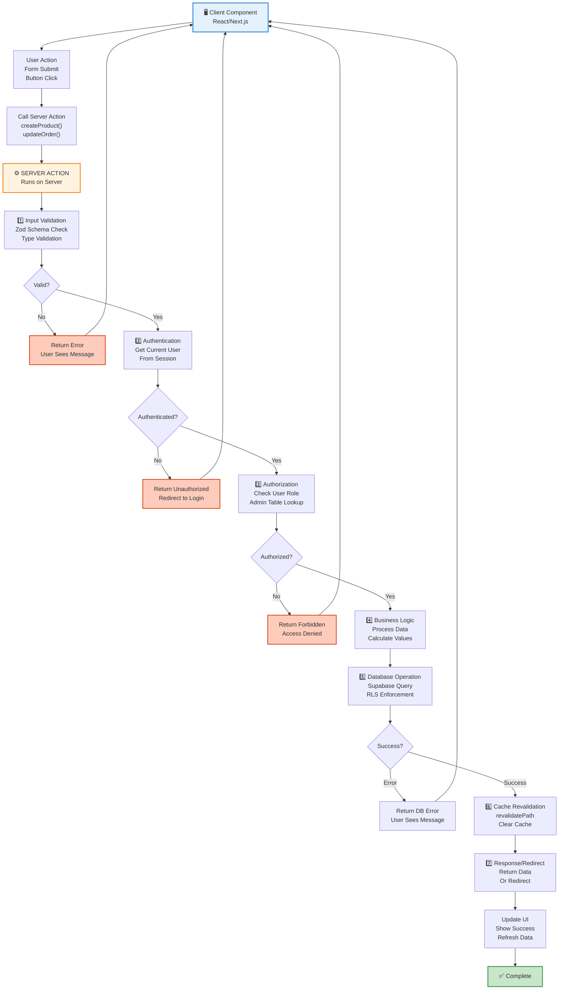

**AI Prompt:**
```
Create a server actions flow diagram showing the complete lifecycle:

1. User performs action (form submit, button click)
2. Call Server Action from client
3. On Server:
   a. Input validation (Zod schemas)
   b. Authentication check (get current user)
   c. Authorization check (verify role/permissions)
   d. Business logic (process data, calculations)
   e. Database operation (Supabase query with RLS)
   f. Cache revalidation (revalidatePath)
   g. Response or redirect
4. UI updated with result

Show error paths for each validation step.
Use colors: blue for client, orange for server, green for success.
Professional flowchart format.
```

---

### **Figure 4.3: Cart State Management Architecture**

**Platform:** Mermaid (Graph)

**Copy-Paste Mermaid Code:**
```mermaid
graph TB
    subgraph Frontend["FRONTEND<br/>(Client-Side)"]
        Component["React Component<br/>Cart Page"]
        Store["🛒 Zustand Store<br/>useCartStore"]
        LocalStorage["💾 Browser Storage<br/>localStorage"]
    end
    
    subgraph Middleware["MIDDLEWARE"]
        Sync["Cart Sync Logic<br/>Auto-Persist"]
    end
    
    subgraph Backend["BACKEND<br/>(Server-Side)"]
        Action["Server Action<br/>createOrder()"]
        Validate["Validate Items<br/>Check Stock"]
        Create["Create Order<br/>Insert DB"]
    end
    
    subgraph Database["DATABASE"]
        Orders["📦 orders Table"]
        OrderItems["📋 order_items Table"]
        Products["🛍️ products Table"]
    end
    
    Component -->|1. Add Item| Store
    Store -->|2. addItem()| LocalStorage
    LocalStorage -->|3. Save| Sync
    
    Component -->|Read Cart| Store
    Store -->|Get Items| LocalStorage
    LocalStorage -->|Display| Component
    
    Component -->|4. Proceed to Checkout| Action
    
    Action -->|5. Get Cart| LocalStorage
    Action -->|6. Extract Items| Validate
    
    Validate -->|Verify Stock| Products
    Validate -->|Check Quantities| OrderItems
    
    Validate -->|7. If Valid| Create
    
    Create -->|Insert Order| Orders
    Create -->|Insert Items| OrderItems
    Create -->|Decrement Stock| Products
    
    Create -->|Clear Cart| Store
    Store -->|Clear| LocalStorage
    
    Create -->|Show Confirmation| Component
    
    style Frontend fill:#e3f2fd,stroke:#1976d2,stroke-width:2px
    style Backend fill:#fff3e0,stroke:#f57c00,stroke-width:2px
    style Database fill:#f3e5f5,stroke:#7b1fa2,stroke-width:2px
    style Middleware fill:#f1f8e9,stroke:#558b2f,stroke-width:2px
```

**AI Prompt:**
```
Create a cart state management architecture diagram showing:

FRONTEND (Client):
- React Component (Cart Page UI)
- Zustand Store (useCartStore with addItem, removeItem, etc.)
- Browser LocalStorage (persistence)

MIDDLEWARE:
- Cart Sync Logic (auto-persist to localStorage)

BACKEND (Server):
- Server Action (createOrder)
- Validation (stock check, item validation)
- Database operations

DATABASE:
- orders table
- order_items table
- products table (for stock decrement)

Show flow:
1. User adds item → stored in Zustand
2. Zustand persists to localStorage
3. On checkout → Server Action reads cart
4. Validate items and stock
5. Create order in database
6. Clear cart
7. Show confirmation

Use arrows to show data flow.
Different colors for frontend, backend, database.
```

---

### **Figure 4.4: Order Creation Sequence Diagram**

**Platform:** Mermaid (Sequence Diagram)

**Copy-Paste Mermaid Code:**
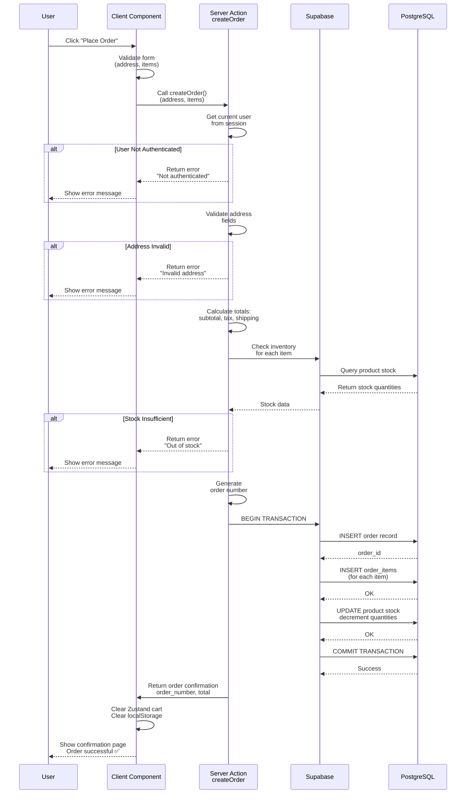

**AI Prompt:**
```
Create a UML sequence diagram showing order creation with these participants:
1. User
2. Client Component
3. Server Action (createOrder)
4. Supabase
5. PostgreSQL Database

Show this sequence:
1. User clicks "Place Order"
2. Client validates form
3. Client calls Server Action
4. Server Action gets current user
5. Validate address fields
6. Calculate totals (subtotal, tax, shipping)
7. Check inventory for each item
8. Generate order number
9. BEGIN TRANSACTION
10. INSERT order record
11. INSERT order_items (foreach item)
12. UPDATE product stock (decrement)
13. COMMIT TRANSACTION
14. Return confirmation to client
15. Clear cart
16. Show confirmation page

Show error paths for:
- Not authenticated
- Invalid address
- Stock insufficient

Professional UML sequence format.
```

---

## 📍 CHAPTER 5: RESULTS & DISCUSSIONS

### **Figure 5.1: Performance Response Times Graph** ⭐ HIGH PRIORITY

**Platform:** Google Sheets / Excel (Better for charts)

**AI Prompt for ChatGPT/Claude:**
```

Create a professional bar chart with:
Title: "API Response Times vs Target (95th Percentile)"

X-axis: API Endpoints
- Product Listing
- Product Detail
- Checkout
- Admin Orders
- Admin Products

Y-axis: Response Time (milliseconds)
Scale: 0-300ms

Data:
- Product Listing: 120ms (green, below 200ms target)
- Product Detail: 150ms (green, below 200ms target)
- Checkout: 80ms (green, below 200ms target)
- Admin Orders: 180ms (green, below 200ms target)
- Admin Products: 250ms (yellow/orange, above 200ms target)

Add:
- Red horizontal line at 200ms (target)
- Green bars for below target
- Orange/yellow bar for above target
- Legend explaining colors
- Grid lines for easier reading
- Professional styling with font size 12

Make it suitable for an academic project report.
```

**Mermaid Alternative (for bar chart):**
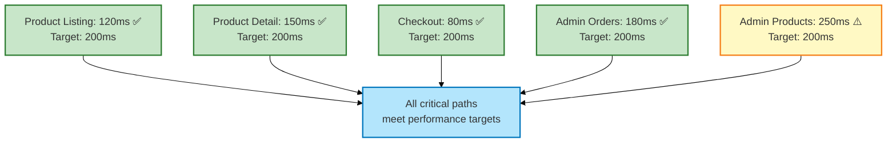

**Easiest Method:** Use Google Sheets
```
1. Open Google Sheets
2. Create table:
   Endpoint | Response Time
   Product Listing | 120
   Product Detail | 150
   Checkout | 80
   Admin Orders | 180
   Admin Products | 250

3. Select data → Insert → Chart
4. Chart type: Column Chart or Bar Chart
5. Add horizontal line at 200ms for target
6. Customize colors (green/red)
7. Add title
8. Download as PNG
```

---

### **Figure 5.2: Page Load Time Comparison**

**Platform:** Google Sheets / Excel

**AI Prompt:**
```
Create a stacked bar chart showing:

Title: "Page Load Time Breakdown (First, Largest, Interactive)"

Pages (X-axis):
- Home
- Products Listing
- Product Detail
- Admin Dashboard

Metrics (Stacked):
- First Contentful Paint (FCP) - Light Green
- Largest Contentful Paint (LCP) - Light Blue
- Time to Interactive (TTI) - Light Orange

Data:
Home: FCP=0.8s, LCP=0.4s, TTI=0.3s (Total: 1.5s)
Products: FCP=1.1s, LCP=0.7s, TTI=0.3s (Total: 2.1s)
Product Detail: FCP=1.3s, LCP=0.7s, TTI=0.5s (Total: 2.5s)
Admin Dashboard: FCP=1.0s, LCP=0.6s, TTI=0.4s (Total: 2.0s)

Y-axis scale: 0-3 seconds
Target line: 2.5 seconds (red horizontal line)

Include legend explaining metrics.
Professional styling suitable for academic report.
```

**Quickest Method:**
```
1. Google Sheets → Create table with pages and times
2. Insert → Chart → Stacked Bar Chart
3. Customize colors (green, blue, orange)
4. Add target line at 2.5s
5. Download as PNG
```

---

### **Figure 5.3: Database Query Performance Chart**

**Platform:** Google Sheets / Excel

**AI Prompt:**
```
Create a horizontal bar chart showing:

Title: "Database Query Performance (95th Percentile)"

Queries (Y-axis):
- Product listing (10k records)
- User orders (1k records)
- Dashboard stats aggregation
- Full-text search

Execution Time (X-axis):
Scale: 0-150ms

Data:
- Product listing: 45ms (green, optimized with indexes)
- User orders: 30ms (green, very fast)
- Dashboard stats: 120ms (yellow, could be optimized)
- Full-text search: 80ms (green, efficient)

Add:
- Green bars for <100ms
- Yellow bars for 100-150ms
- Show optimization method for each (indexes, query optimization)
- Target line at 100ms (red)
- Legend

Professional styling for academic report.
```

---

### **Figure 5.4: Security Test Results**

**Platform:** Mermaid (Radial/Gauge) or Simple Chart

**AI Prompt:**
```
Create a security test results visualization showing:

Title: "Security Verification Results"

Tests Performed (8 total):
1. ✅ JWT Token Validation
2. ✅ HTTP-Only Cookie Storage
3. ✅ Session Expiration (24 hours)
4. ✅ Admin Role Verification
5. ✅ User Data Isolation (RLS)
6. ✅ Input Validation & Sanitization
7. ✅ CSRF Protection (SameSite)
8. ✅ Email Verification Flow

Result: 8/8 = 100% PASSED

Display as:
- Circular gauge showing 100% (green)
- Or pie chart with 100% security compliance
- Or checklist with all items marked ✅

Color: Green for passed, red would be for failed (but all passed).
Professional styling.
```

**Mermaid Alternative:**
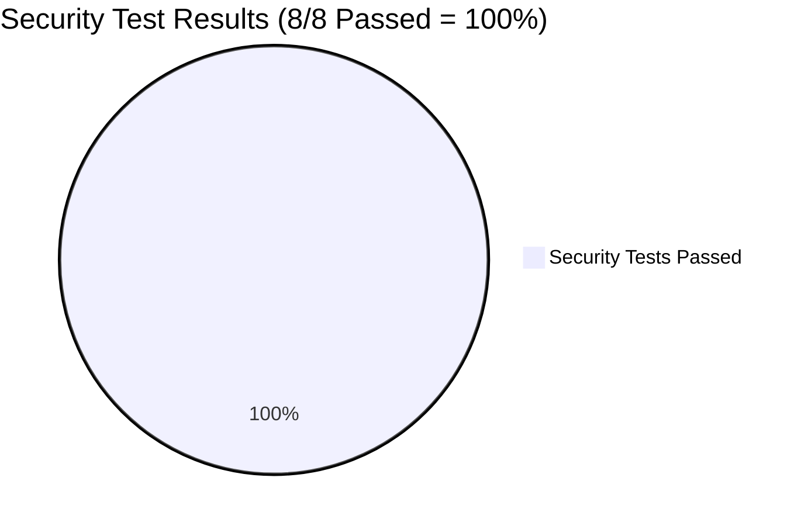

---

### **Figure 5.5: Functional Requirements Coverage**

**Platform:** Google Sheets / Mermaid

**AI Prompt:**
```
Create a functional requirements coverage visualization showing:

Title: "Functional Requirements Implementation Status"

Categories:
1. User Management: 95% ✅ (email verification pending)
2. Product Catalogue: 100% ✅
3. Shopping Cart: 100% ✅
4. Checkout Process: 95% ✅ (payment pending)
5. Wishlist: 100% ✅
6. Product Reviews: 100% ✅
7. Blog Content: 100% ✅
8. Admin Dashboard: 95% ✅ (some settings pending)

Overall: 98.5% ✅

Display as:
- Horizontal progress bars (one per category)
- Each bar shows percentage (95%, 100%, etc.)
- Green for 100%, light green for 95%
- Show legend explaining pending items

Or as:
- Pie chart: 98.5% Complete vs 1.5% Pending
- Donut chart: Completion percentage

Professional styling suitable for technical report.
```

**Mermaid Gauge:**
```mermaid
gauge title Functional Requirements Coverage
    90 : Poor
    95 : Acceptable
    98.5 : Good
    100 : Excellent
    98.5
```

---

## 🎯 SUMMARY: WHERE TO GET MERMAID CODE

### **Easy Method - Copy-Paste Ready:**

1. **Mermaid Live Editor**: https://mermaid.live
   - Copy the Mermaid code from this guide
   - Paste into editor
   - Export as PNG/SVG

2. **Google Sheets**: For charts and graphs
   - Create table
   - Insert chart
   - Download as PNG

3. **ChatGPT/Claude Prompts**: For any diagram not in Mermaid
   - Use the AI prompts provided above
   - Ask to create the diagram
   - Export and save

4. **Draw.io**: For complex diagrams
   - Use the prompts to describe what you need
   - Or use Mermaid syntax conversion
   - Export as image

---

## 📋 COMPLETE CHECKLIST WITH TOOLS

| Figure | Type | Tool | Status |
|--------|------|------|--------|
| 1.1 | Chart | Google Sheets | ✓ Prompt |
| 1.2 | Architecture | Mermaid | ✓ Code |
| 2.1 | UML Use Case | Mermaid | ✓ Code |
| 2.2 | UML Use Case | Mermaid | ✓ Code |
| 3.1 | ER Diagram | Mermaid | ✓ Code |
| 3.2 | Architecture | Mermaid | ✓ Code |
| 3.3 | Flowchart | Mermaid | ✓ Code |
| 3.4 | Process Flow | Mermaid | ✓ Code |
| 3.5 | Hierarchy | Mermaid | ✓ Code |
| 3.6 | Component Tree | Mermaid | ✓ Code |
| 4.1 | Directory Tree | Mermaid | ✓ Code |
| 4.2 | Flowchart | Mermaid | ✓ Code |
| 4.3 | Architecture | Mermaid | ✓ Code |
| 4.4 | Sequence | Mermaid | ✓ Code |
| 5.1 | Bar Chart | Google Sheets | ✓ Prompt |
| 5.2 | Stacked Bar | Google Sheets | ✓ Prompt |
| 5.3 | Horizontal Bar | Google Sheets | ✓ Prompt |
| 5.4 | Pie/Gauge | Mermaid | ✓ Code |
| 5.5 | Progress/Pie | Mermaid/Sheets | ✓ Code |

---

## 🚀 HOW TO USE THIS GUIDE

### **For Mermaid Diagrams (Fastest):**

1. Go to https://mermaid.live
2. Find the figure in this guide
3. Copy the Mermaid code
4. Paste into editor
5. Press Render
6. Export as PNG
7. Download and save

### **For Google Sheets Charts:**

1. Open Google Sheets
2. Create table with data from prompt
3. Select → Insert Chart
4. Customize as described
5. Download as PNG

### **For Complex Diagrams:**

1. Copy the AI prompt from this guide
2. Paste into ChatGPT/Claude
3. Ask to create the diagram
4. Export and save

---

## ✅ ALL READY TO USE!

**Every figure has:**
✓ Mermaid code (copy-paste ready), OR
✓ AI prompt (for ChatGPT/Claude), OR
✓ Instructions (for Google Sheets)

**Just copy, generate, and insert into your Word document!**

---

*Happy diagramming! 🎨*
