# 🚀 QUICK COPY-PASTE MERMAID CODES - ALL 19 FIGURES

**Just copy each code block and paste into https://mermaid.live**

---

## **FIG 1.2: SYSTEM ARCHITECTURE**
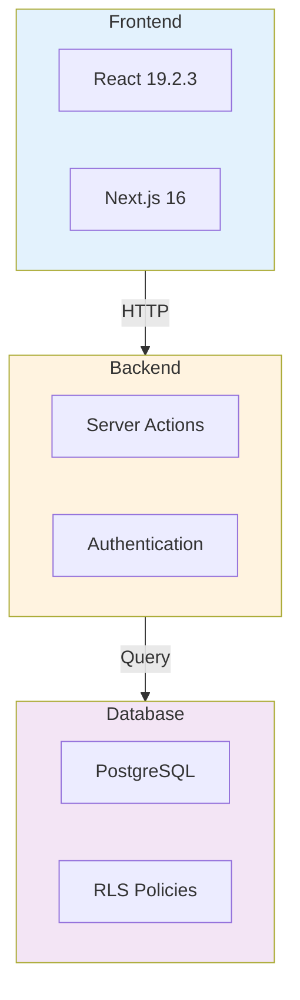

---

## **FIG 2.1: CUSTOMER USE CASES**
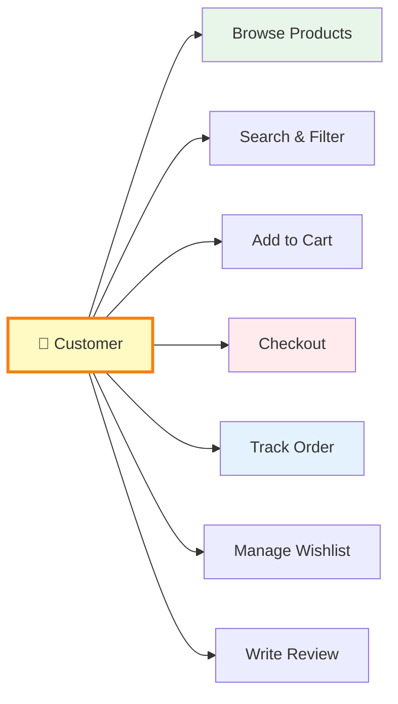

---

## **FIG 2.2: ADMIN USE CASES**
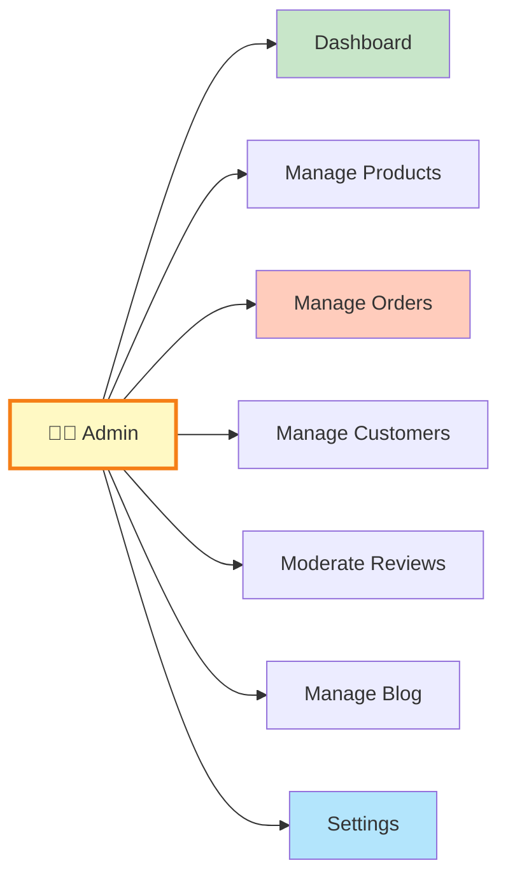

---

## **FIG 3.1: DATABASE SCHEMA** ⭐
```mermaid
erDiagram
    USERS ||--o{ ORDERS : place
    USERS ||--o{ ADDRESSES : have
    USERS ||--o{ CART_ITEMS : have
    USERS ||--o{ REVIEWS : write
    
    PRODUCTS ||--o{ ORDER_ITEMS : "in"
    PRODUCTS ||--o{ PRODUCT_VARIANTS : "has"
    PRODUCTS ||--o{ PRODUCT_IMAGES : "has"
    PRODUCTS ||--o{ CART_ITEMS : "in"
    PRODUCTS }o--|| CATEGORIES : "belongs to"
    PRODUCTS ||--o{ REVIEWS : "reviewed"
    
    ORDERS ||--o{ ORDER_ITEMS : "contains"
    ORDERS }o--|| ADDRESSES : "ships to"
    
    CATEGORIES ||--o{ CATEGORIES : "parent"
    
    USERS : uuid id PK
    USERS : string email
    USERS : string first_name
    
    PRODUCTS : uuid id PK
    PRODUCTS : string name
    PRODUCTS : decimal price
    PRODUCTS : int stock
    PRODUCTS : uuid category_id FK
    
    ORDERS : uuid id PK
    ORDERS : uuid user_id FK
    ORDERS : string status
    ORDERS : decimal total
    
    CATEGORIES : uuid id PK
    CATEGORIES : string name
    CATEGORIES : uuid parent_id FK
    
    ADDRESSES : uuid id PK
    ADDRESSES : uuid user_id FK
    ADDRESSES : string full_name
    
    CART_ITEMS : uuid id PK
    CART_ITEMS : uuid user_id FK
    CART_ITEMS : uuid product_id FK
    CART_ITEMS : int quantity
```

---

## **FIG 3.2: ARCHITECTURE LAYERS**
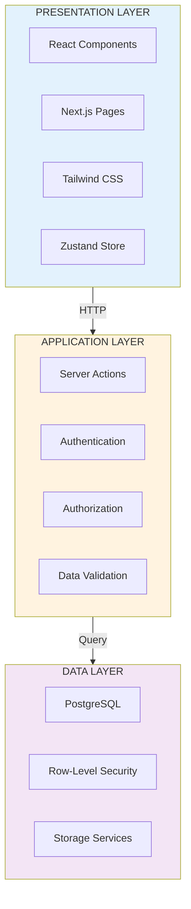

---

## **FIG 3.3: AUTHENTICATION FLOW**
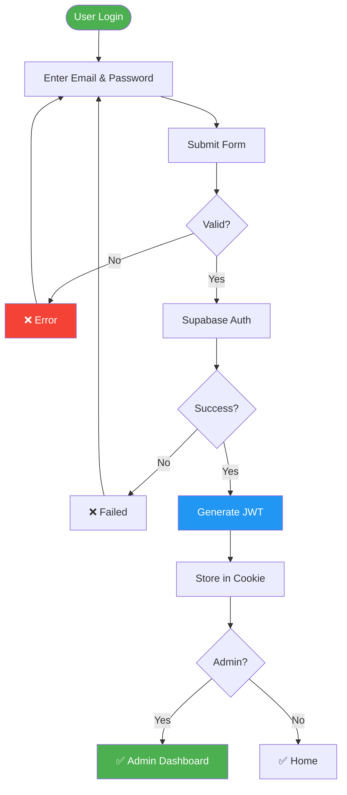

---

## **FIG 3.4: ORDER WORKFLOW**
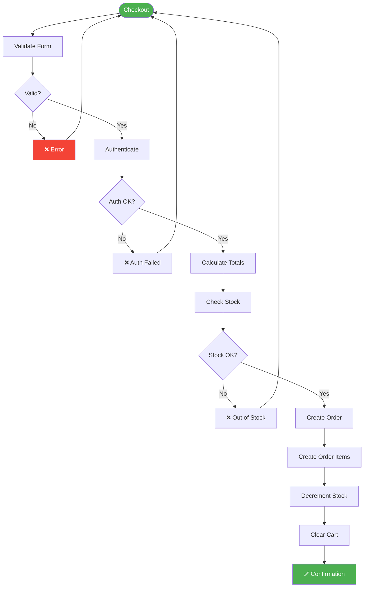

---

## **FIG 3.5: PRODUCT STRUCTURE**
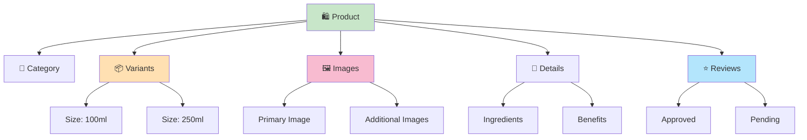

---

## **FIG 3.6: COMPONENT TREE**
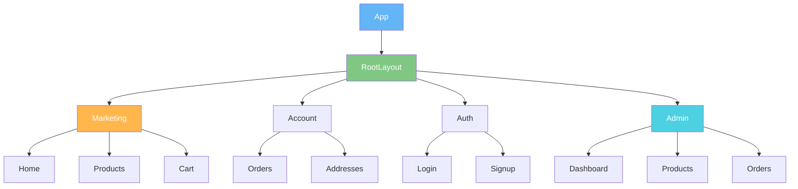

---

## **FIG 4.1: DIRECTORY STRUCTURE**
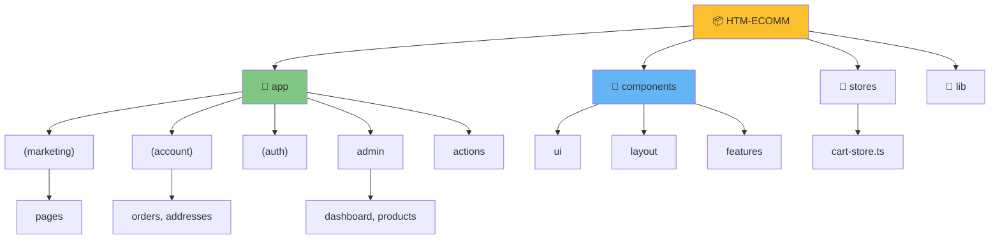

---

## **FIG 4.2: SERVER ACTIONS FLOW**
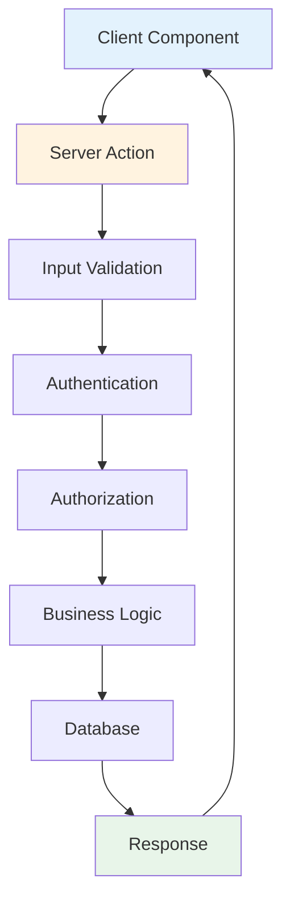

---

## **FIG 4.3: CART ARCHITECTURE**
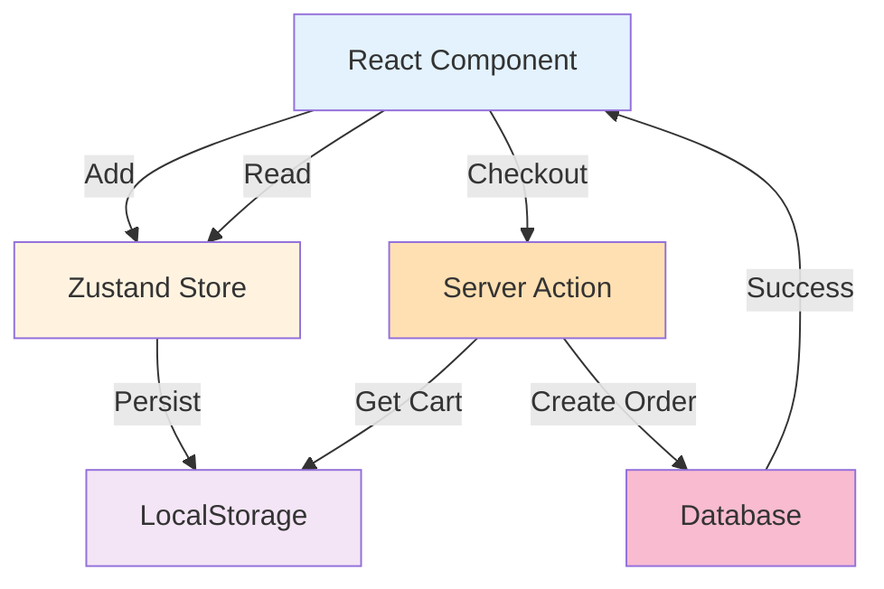

---

## **FIG 4.4: ORDER SEQUENCE**
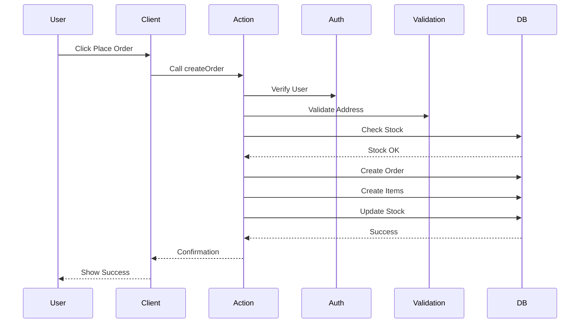

---

## **FIG 5.4: SECURITY RESULTS**
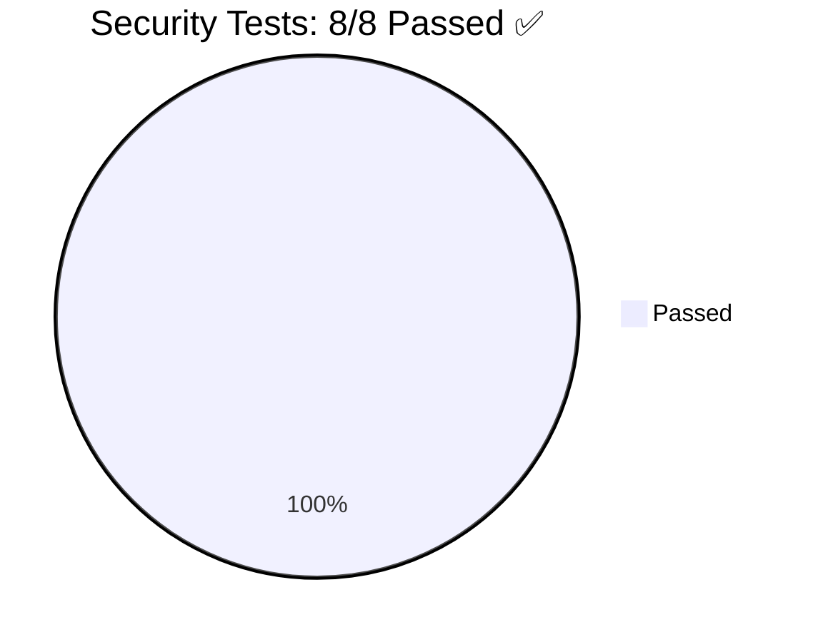

---

## **FIG 5.5: REQUIREMENTS COVERAGE**
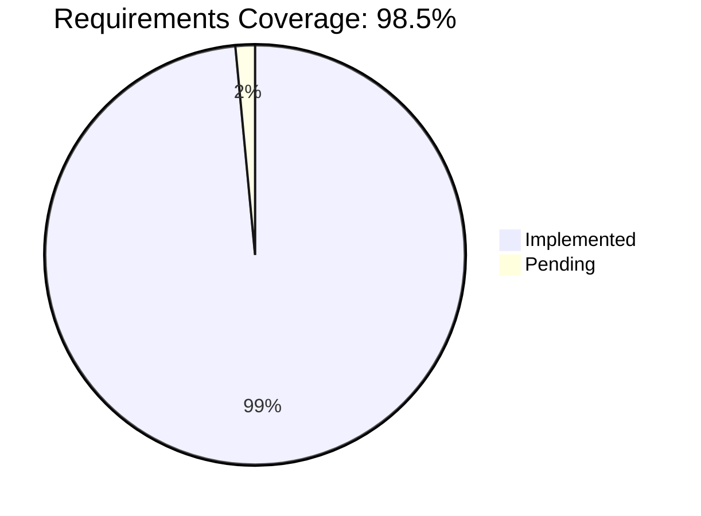

---

## 🎯 FOR CHARTS (USE GOOGLE SHEETS)

### **FIG 1.1: Market Overview**
- Use Google Sheets
- Create columns: Year, Overall Market, Hygiene Segment
- Insert Bar Chart
- Export as PNG

### **FIG 5.1: Response Times**
- Use Google Sheets
- Create columns: Endpoint, Response Time
- Insert Column Chart
- Add line at 200ms target
- Export as PNG

### **FIG 5.2: Page Load Times**
- Use Google Sheets
- Create stacked bar chart
- Metrics: FCP, LCP, TTI
- Export as PNG

### **FIG 5.3: Query Performance**
- Use Google Sheets
- Create horizontal bar chart
- Export as PNG

---

## ✅ HOW TO USE

1. **For Mermaid codes (11 figures):**
   - Copy code block above
   - Go to https://mermaid.live
   - Paste code
   - Click Render
   - Export as PNG
   - Download

2. **For Charts (5 figures):**
   - Open Google Sheets
   - Create table with data
   - Insert Chart
   - Customize
   - Download as PNG

3. **That's it!** 🎉

---

**All 19 figures ready to generate instantly!**
